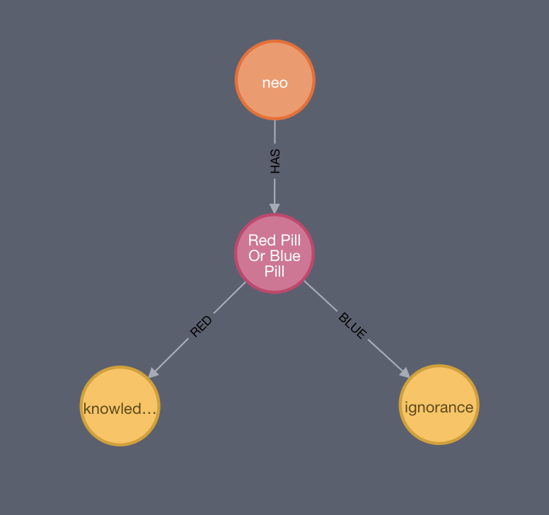
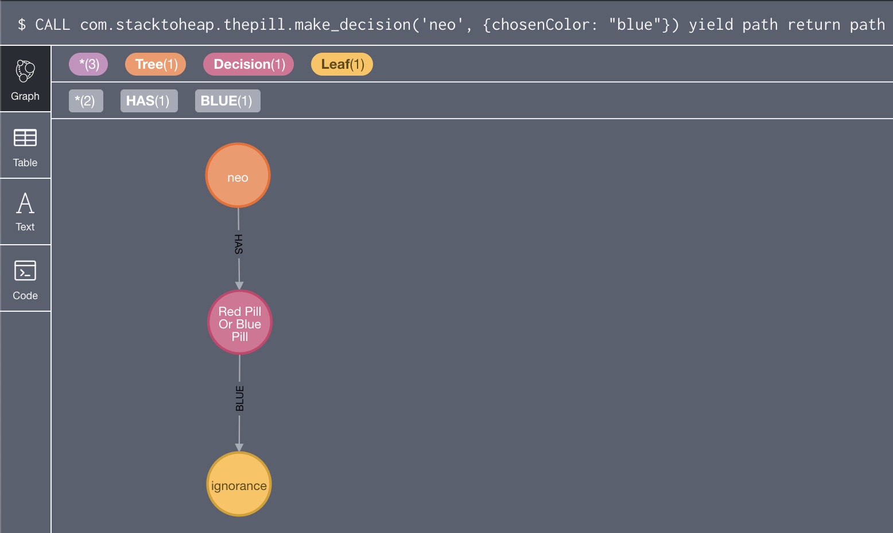

# thepill
Decision Trees with Neo4J


<p align="center">

</p>

## Features

Model decision trees using Neo4j and Javascript based decision evaluation.

## Example

```
CREATE (tree:Tree { name: 'neo' })
CREATE (red:Leaf { value: 'knowledge' })
CREATE (blue:Leaf { value: 'ignorance' })
CREATE (pill: Decision { name: 'Red Pill Or Blue Pill', question: 'Red Pill Or Blue Pill', 
  choice: 'result = {relationship: \"RED\"}; if(chosenColor === \"blue\") result = {relationship: \"BLUE\"};' })
CREATE (tree)-[:HAS]->(pill)
CREATE (pill)-[:RED]->(red)
CREATE (pill)-[:BLUE]->(blue)
```
Traverse the decision tree and make a decision:

```
CALL com.stacktoheap.thepill.make_decision('neo', {chosenColor: "blue"}) yield path return path
```


## Example explained

Create the root of the tree:

```
CREATE (tree:Tree { name: 'neo' })
```

Create the final decision for the tree (the leaves):

```
CREATE (red:Leaf { value: 'knowledge' })
CREATE (blue:Leaf { value: 'ignorance' })
```

Create the decision node with result evaluation using JS code:

```
CREATE (pill: Decision { name: 'Red Pill Or Blue Pill', question: 'Red Pill Or Blue Pill', 
  choice: 'result = {relationship: \"RED\"}; if(chosenColor === \"blue\") result = {relationship: \"BLUE\"};' })
```

`result` is the variable that is used to make the decision. It is to be set to an object with two properties:

- `relationship` - The relationship type for the chosen decision
- `properties` - Map of properties that choose the next node (useful if there are multiple relationships of the same type)

The variables available in the choice script are facts supplied to the tree at evaluation time (see below)

Create the relationships:

```
CREATE (tree)-[:HAS]->(pill)
CREATE (pill)-[:RED]->(red)
CREATE (pill)-[:BLUE]->(blue)
```

Traverse the tree and make decision:

```
CALL com.stacktoheap.thepill.make_decision('neo', {chosenColor: "blue"}) yield path return path
```

<p align="center">

</p>

 

## Procedure Installation

1. Download the latest jar from https://github.com/manojlds/thepill/releases

2. Copy the jar to the plugins folder of Neo4J instance - `<neo4j-home>/plugins`

3. To use property based leaves, set the following configuration in `<neo4j-home>/conf/neo4j.conf`:

    ```
    thepill.property_based_leaves=true
    thepill.thepill.leaves_property=is_leaf
    ```

    With property based leaves enabled, existing nodes can be reused as leaves in the decision tree by adding the property specified by the `thepill.thepill.leaves_property` configuration.

4. (Re)Start the server

5. Apply the schema for thepill:

    ```cypher
    CALL com.stacktoheap.thepill.schema.generate
    ```
    
 ## Extension Installation
 
 The optional unmanaged server extension can be installed as follows:
 
 1. Download the latest jar from https://github.com/manojlds/thepill/releases
 
 2. Copy the jar to the plugins folder of Neo4J instance - `<neo4j-home>/plugins`
 
 3. Add the following configuration in `<neo4j-home>/conf/neo4j.conf`:
 
    ```
    dbms.unmanaged_extension_classes=com.stacktoheap.thepill=/thepill

    ```
 4. Restart the server
 
 5. The `<server>/thepill/make_decision` endpoint is available for use. Example:
 
    ```shell
    curl -H 'Content-Type: application/json' -X POST  http://localhost:7474/thepill/make_decision/neo -d "{\"chosenColor\": \"blue\"}"
    ```
  

## Build

Compile and run tests with `./gradlew build`

Create fat jar with `./gradlew shadowJar` 

## Note

Based on - https://github.com/maxdemarzi/decision_trees_with_rules

Differs in the following ways:

1. Uses Javascript for script evaluation rather than Java.
2. Ability to choose relationships based on properties.
3. No insecure APIs usage.
4. Updated for latest Neo4j and written in Kotlin.
